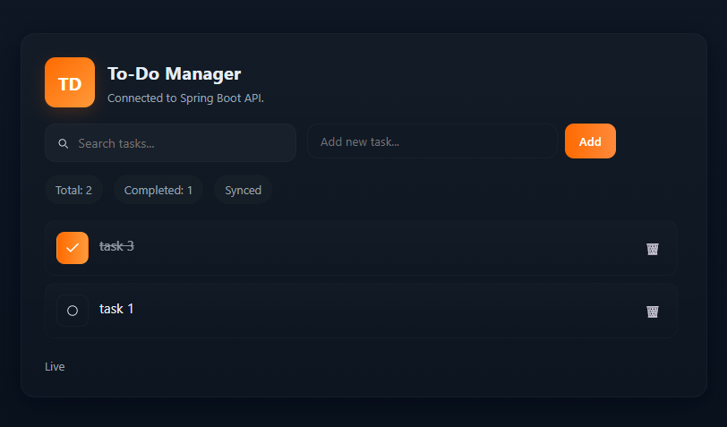

# 📌 To-Do Manager (React + Spring Boot + PostgreSQL)

A modern full-stack To-Do application built with **React (Vite)** for the UI and **Spring Boot (REST API)** for server logic. 
Tasks are stored in a **PostgreSQL database** and accessed through REST endpoints using **Axios**. 
This project demonstrates clean UI/UX, API-driven state management, and real-world CRUD features.

---

## 🖼️ UI Preview

> Clean dark-themed design optimistic UI.





---

## 🚀 Features

✔ Add, delete, and toggle tasks (mark complete) 
✔ Real-time search (Pending)
✔ Fast UI with optimistic updates 
✔ PostgreSQL-based persistence 
✔ Responsive UI with custom styling 
✔ Structured REST API (Spring Boot) 
✔ Component-based code organization (React)

---

## 🛠️ Tech Stack

| Layer | Technology |
|-------|------------|
| **Frontend** | React (Vite), Axios |
| **Backend** | Spring Boot (REST API) |
| **Database** | PostgreSQL |
| **UI** | Custom CSS, Bootstrap Icons |

---

## 🧰 How to Run Locally

### 🔹 Backend (Spring Boot)

```bash
cd backend
./mvnw spring-boot:run

### 🔸 Frontend (React + Vite)
cd frontend
npm install
npm run dev